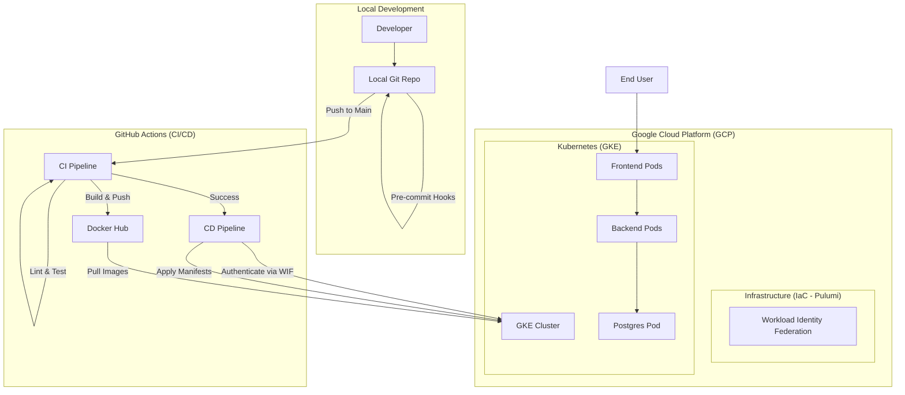

# Dani Proekt (Student Exercise)

## Описание
Този проект е цялостна демонстрация на съвременен DevOps жизнен цикъл, включващ контейнеризация (Docker), облачна инфраструктура (GCP), Infrastructure as Code (Pulumi) и автоматизирани CI/CD процеси. Приложението представлява микросървисна архитектура с Backend (Go), Frontend (Next.js) и База данни (PostgreSQL).

## Архитектурна Диаграма


## Инструкции за стартиране

### 1. Локално стартиране с Docker Compose
```bash
docker compose up --build
```

### 2. Стартиране на Инфраструктурата (GCP)
За детайлни инструкции как да настроите GCP и Pulumi, моля вижте [SETUP.md](SETUP.md).
```bash
cd iac
pulumi up
```

### 3. CI/CD Процес
При всеки `push` към `main` клон:
1. Автоматично се изпълняват тестове и линтери.
2. Билдват се Docker имиджи и се качват в Docker Hub.
3. Промените се деплойват автоматично в Google Kubernetes Engine (GKE).

## Използвани Технологии
- **Backend**: Go (Golang)
- **Frontend**: Next.js (TypeScript, Tailwind CSS)
- **Database**: PostgreSQL
- **Orchestrator**: Google Kubernetes Engine (GKE)
- **IaC**: Pulumi (Go SDK)
- **CI/CD**: GitHub Actions
- **Cost Transparency**: Infracost
- **Security**: Workload Identity Federation, Pre-commit Hooks, Gitleaks

## Структура на Проекта
- `backend/`: API сървър, написан на Go.
- `frontend/`: Потребителски интерфейс (Next.js).
- `iac/`: Infrastructure as Code файлове (Pulumi).
- `k8s/`: Kubernetes манифести за деплоймънт.
- `.github/workflows/`: CI/CD дефиниции.
- `docs/`: Допълнителна документация и диаграми.
- `SETUP.md`: Детайлни стъпки за конфигурация.
- `.pre-commit-config.yaml`: Конфигурация за pre-commit куки.
